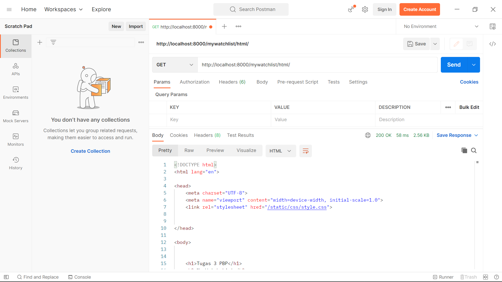
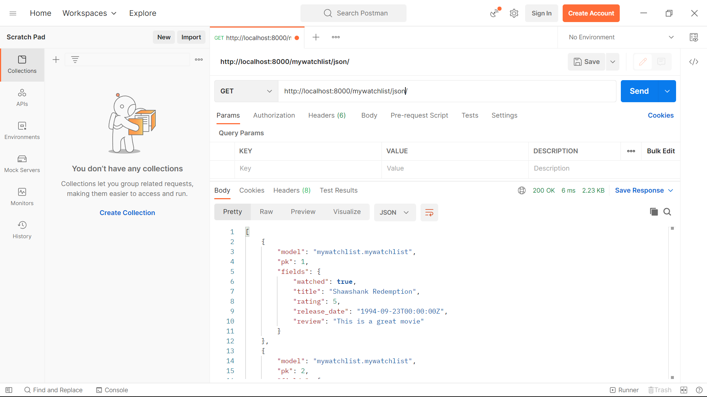
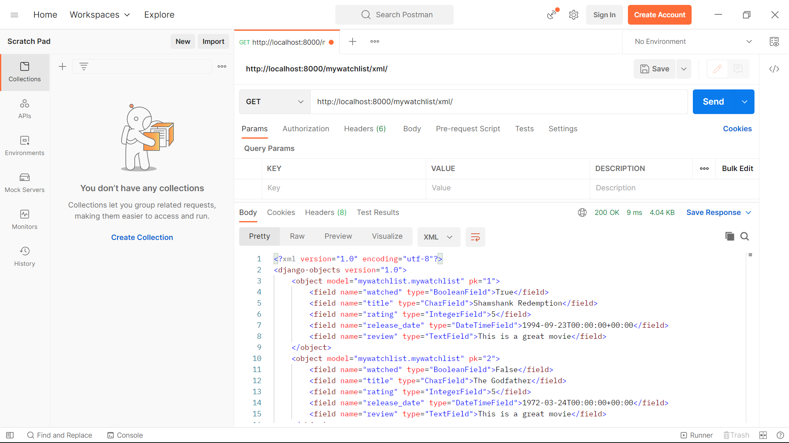
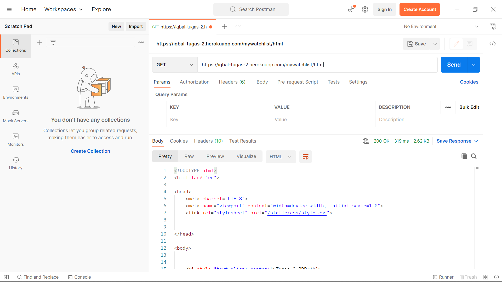
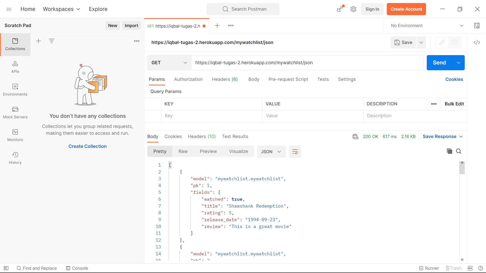
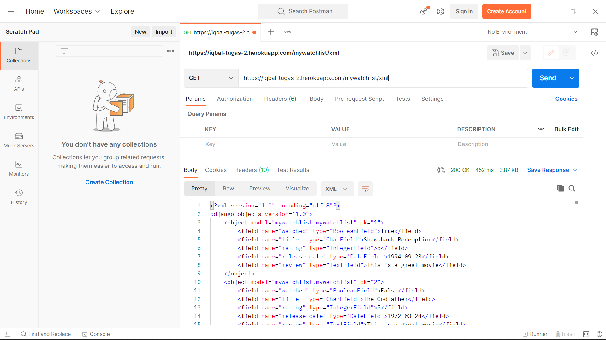

# Live Demo Link 🚀
[HTML page 💻](https://iqbal-tugas-2.herokuapp.com/mywatchlist/html/)

[JSON page 📃](https://iqbal-tugas-2.herokuapp.com/mywatchlist/json/)

[XML page 📄](https://iqbal-tugas-2.herokuapp.com/mywatchlist/xml/)

## Perbedaan JSON, XML, dan HTML
- HTML. HTML (HyperText Markup Language) tidak dapat digunakan untuk pertukaran data antar aplikasi, tidak seperti JSON dan XML. HTML hanya dapat digunakan untuk menampilkan data pada laman website. HTML tidak memiliki sintaks khusus untuk menyimpan data. Tetapi dapat digunakan untuk menampilkan data dalam bentuk teks, gambar, atau pun video pada laman website.
- JSON. JSON (Javascript Object Notation) adalah sebuah format pertukaran data yang ringan dan termasuk bahasa tersendiri. JSON didasari oleh bahasa Javascript. Pada dasarnya syntax JSON sama dengan syntax pembuatan object pada Javascript. 
- XML. XML (Extensible Markup Language) adalah sebuah bahasa markup yang digunakan untuk menyimpan dan mengirimkan data. XML tidak dapat digunakan untuk menampilkan data, tetapi dapat digunakan dengan berbagai cara untuk pertukaran data.
- JSON vs XML:
    1. JSON lebih mudah dibaca daripada XML
    2. JSON lebih mudah untuk diolah daripada XML
    3. JSON mendukung penggunaan array, sedangkan XML tidak
    4. XML lebih aman daripada JSON
    5. XML mendukung *komentar*, JSON tidak

## Mengapa kita memerlukan data delivery dalam pengimplementasian sebuah platform?
Pada umumnya, software atau pun aplikasi terdiri atas dua bagian, yaitu frontend (tampilan yang dilihat user) dan backend (logic app dan termasuk database). Pengimplementasian data delivery diperlukan karena frontend dan backend tidak dapat berinteraksi secara langsung satu sama lain untuk pertukaran data (dari frontend ke backend dan sebaliknya), melainkan memerlukan sebuah perantara. Dalam hal ini, JSON dan XML dapat menjadi perantara tersebut. JSON dan XML akan mempermudah formatting dan pengolahan data yang akan dikirimkan atau diterima oleh frontend dan backend karena mempunyai sintaks tersendiri.

## Cara mengimplementasikan poin 1 sampai 3
1. Membuat class Model pada models.py untuk template data fields yang akan disimpan pada database. Dalam hal ini, class MyWatchList memiliki lima fields, yaitu watched, title, rating, release_date, dan review. Kemudian buat data dummy pada fixtures/initial_mywatchlist_data.json untuk di-load dan ditampilkan pada URL yang diminta.
2. Mengimplementasikan fungsi untuk menampilkan data pada HTML, JSON, dan XML pada views.py. Fungsi tersebut akan memanggil data dari dummy data dan mengembalikan data tersebut dalam bentuk HTML, JSON, atau XML. Menggunakan method render untuk menampilkan data pada HTML dan menggunakan HttpResponse untuk mengirim data dalam bentuk JSON dan XML.
3. Mengimplementasikan URL path di urls.py. /mywatchlist/html untuk HTML, /mywatchlist/json untuk JSON, dan /mywatchlist/xml untuk XML. Pengimplementasian path tersebut membutuhkan import method dari views.py yang telah dibuat pada poin 2.

## Screenshot POSTMAN
1. http://localhost:8000/mywatchlist/html

2. http://localhost:8000/mywatchlist/json

3. http://localhost:8000/mywatchlist/xml

4. https://iqbal-tugas-2.herokuapp.com/mywatchlist/html

5. https://iqbal-tugas-2.herokuapp.com/mywatchlist/json

6. https://iqbal-tugas-2.herokuapp.com/mywatchlist/xml
