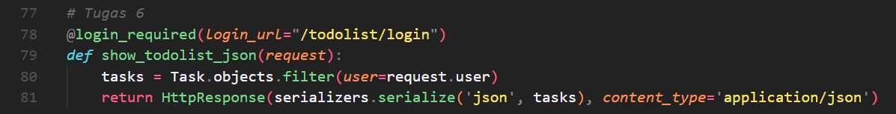
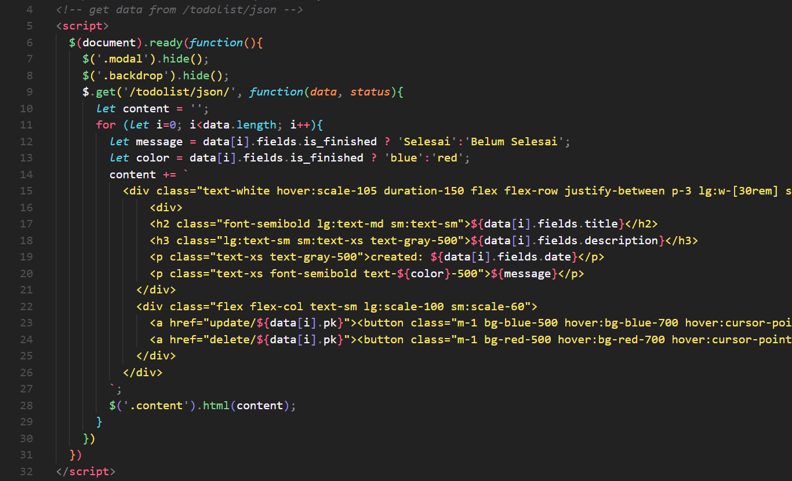
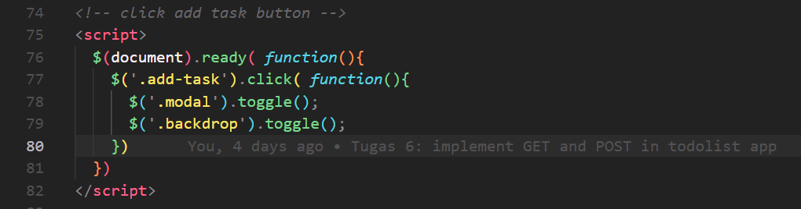
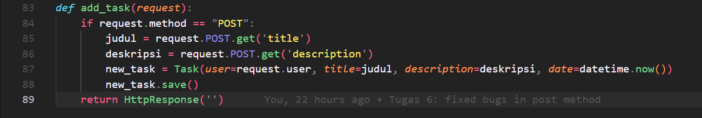

## Asynchronus Programming dan Synchronus programming
- Asynchronus programming: multi-thread yang artinya operasi atau program dapat berjalan secara paralel, non-blocking yang artinya dapat mengirim multiple request ke server
- Synchronus programming: single-thread yang artinya hanya dapat menjalankan satu operasi atau program pada satu saat, blocking yang artinya hanya dapat mengirimkan stau request ke server dan dapat mengirimkan request lagi jika request sebelumnya sudah selesai

## Paradigma Event-Driven Programming
- sebuah paradigma dimana entitas berkomunikasi secara tidak langsung dengan mengirimkan pesan ke entitas lain melalui sebuah perantara. 
- contoh: pada saat button `Add Task` diklik oleh user, maka akan menyebabkan sebuah event terjadi, yaitu akan muncul modal pada laman website

## Asynchronus Programming pada AJAX
AJAX adalah sebuah teknik yang dapat membuat laman website ter-*update* secara asinkronus. Artinya browser tidak perlu *reload* seluruh laman website ketika hanya ada perubahan data yang kecil. AJAX akan mengirimkan request ke server, dan melanjutkan eksekusi tanpa menunggu balasan dari server terlebih dahulu.

## Implementasi checklist
1. Buat path `/todolist/json` pada urls.py dengan function yg sesuai untuk mengembalikan seluruh data task dalam bentuk json dan menggunakan AJAX GET untuk menampilkan data

2. Membuat tombol `Add Task` unutk membuka sebuah modal dengan form

3. Membuat path `/todolist/add` dengan funciton yang sesuai untuk menambahkan task baru

