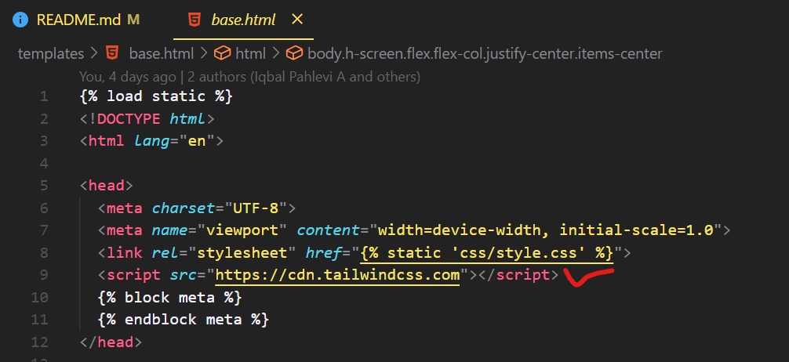
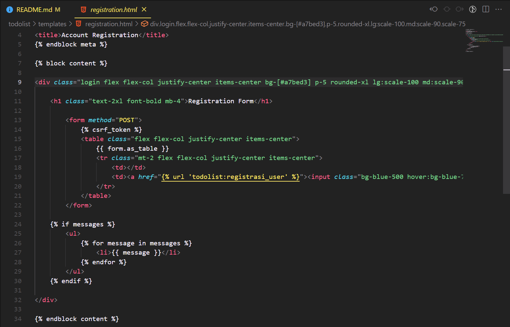
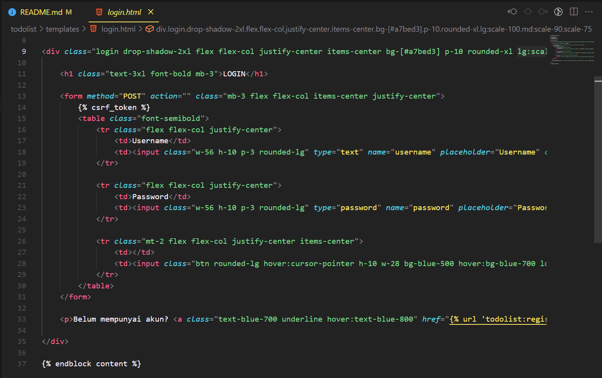
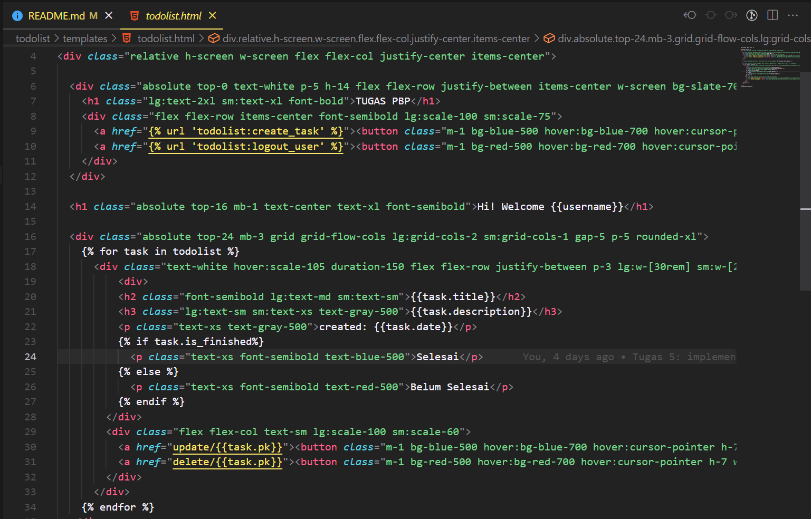
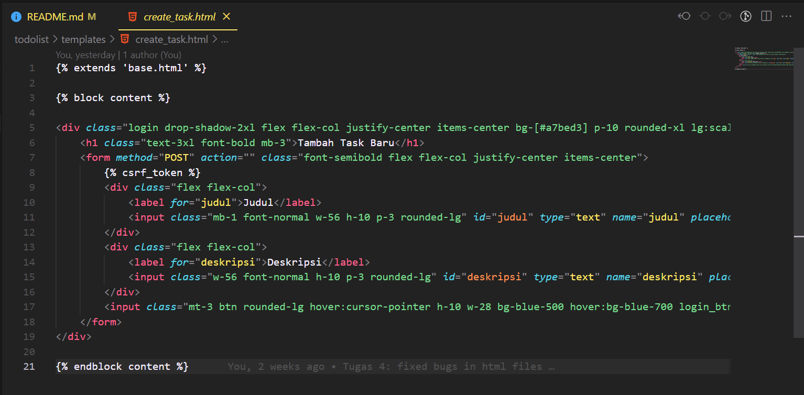

# Live Demo Link 🚀
[Todolist Page 🧾](https://iqbal-tugas-2.herokuapp.com/todolist/)

[Register Page 📝](https://iqbal-tugas-2.herokuapp.com/todolist/register)

[Login Page 📃](https://iqbal-tugas-2.herokuapp.com/todolist/login)

[Create New Task Page 🗒️](https://iqbal-tugas-2.herokuapp.com/todolist/create-task)

## Kegunaan `` pada elemen `<form>` dan apa yang terjadi apabila tidak ada potongan kode tersebut?
- *csrf_token* berguna untuk melindungi semua data dari form yang menggunakan method POST dari *breach attacks*. 
- apabila tidak menggunakan *csrf_token* pada `<form>`, *attacker* dapat dengan mudah menggunakan *authenticated state* seorang user untuk mengirimkan *request* yang tidak sesuai dengan keinginan user. Dan apabila *attack* sukses pada akun admin, hal itu dapat membahayakan seluruh *web app*

## Apakah dapat membuat elemen `<form>` secara manual? 
Tentu saja hal itu dapat dilakukan. 
- Caranya adalah dengan langsung membuat sebuah form di HTML, diawali dengan tag `<form>` dan diakhiri dengan tag `</form>`. 
- Selanjutnya adalah menambahkan atribut `method="<http-request>"` pada tag `<form>`
- Kemudian, di antara kedua tag tersebut kita dapat menambahkan tag `<input>` untuk menerima input dari user (baik dalam bentuk text atau pun yang lainnya). 
- Di dalam tag `<input>` harus ditambahkan atribut `name="<nama-variable>"`, agar data input dari user tersebut dapat diambil oleh *views.py* dengan memanggil suatu perintah sesuai HTTP request. Misalnya `request.POST.get("judul")` untuk mendapatkan input judul.

## Jelaskan proses alur data dari submisi yang dilakukan oleh pengguna melalui HTML form, penyimapanan pada database, hingga munculnya pada *template* HTML
- User memberikan input pada form HTML yang ada
- function yang sesuai pada *views.py* akan mendapatkan input dari user di HTML menggunakan perintah `request.POST.get("<name>")` dan menyimpannya ke dalam suatu variable
- Dari beberapa variable yang telah ada (judul dan deskripsi), akan dibuat object **Task** baru dan akan langsung disimpan ke dalam database menggunakan perintah `<object>.save()`
- Kemudian pada main function (dalam hal ini, punya saya adalah `show_todolist`), akan didapatkan semua todolist (objects **Task**) sesuai dengan kepemilikan masing-masing, menggunakan perintah `Task.objects.filter(user_id=request.user.id)` dan mengirimkannya ke template HTML sebagai context
- Di template HTML akan dilakukan iterasi pada *todolist* tersebut dan ditampilkan sebagai satu todolist satu kolom pada tabel

## Jelaskan bagaimana cara mengimplementasikan checklist di atas
- pembuatan django app todolist dengan perintah `python manage.py startapp todolist` 
- menambahkan `path('', include('todolist.urls'))` pada *urls.py* di *project_django*
- Membuat **Task** class pada models.py dengan field user, date, title, dan description
- membuat form registrasi menggunakan UserCreationForm() di views.py. kemudian membuat fungsi pada views.py untuk login dan logout yang diintegrasikan dengan form pada html dengan method POST
- mengimplementasikan fungsi untuk membuat task baru pada main function di `show_todolist` dengan argumen user, title, description, date dengan cara membuat object baru dari class **Task** dan menyimpannya ke database
- Membuat form untuk pembuatan task secara manual di folder templates (tanpa menggunakan forms.py) dengan menggunakan method POST
- Membuat routing pada todolist/urls.py sesuai requirements menggunakan function yang sesuai dari views.py
- Melakukan deployment ke Heroku menggunakan Repository dari GitHub. Kemudian membuat 2 akun dummy beserta 3 dummy data pada website hasil deployment tersebut

# Tugas 5
## Perbedaan Inline, Internal, dan External CSS
1. Inline CSS: menggunakan atribut `style` pada tag HTML. Contoh: `<h1 style="color:blue;">Ini adalah contoh inline CSS</h1>`
   - Kelebihan: dapat langsung digunakan pada tag HTML yang diinginkan, tidak perlu membuat file CSS terpisah
   - Kekurangan: membuat struktur file HTML terlihat berantakan apabila menambahkan banyak styling
2. Internal CSS: menggunakan tag `<style>` di dalam `<head>` HTML, kemudian menulis kode css di dalam tag `<style>` tersebut
   - Kelebihan: tidak perlu membuat file CSS terpisah, bisa langsung menambahkan styling pada file HTML 
   - Kekurangan: meningkatkan loading time pada website karena styling yang ditambahkan langsung pada file HTML
3. External CSS: menggunakan tag `<link>` untuk menghubungkan file HTMl dengan file CSS yang terpisah
   - Kelebihan: file HTML jadi lebih rapi, dapat menggunakan satu file CSS untuk banyak file HTML
   - Kekurangan: laman website akan butuh waktu loading untuk me-load styling yang ada di file CSS

## Tag HTML5
1. `<header>`: header pada website
2. `<nav>`: navigasi pada website
3. `<section>`: section pada website
4. `<article>`: article pada website
5. `<footer>`: footer pada website
6. `<main>`: main content pada website
7. `<figcaption>`: caption sebuah figure

## CSS selector
1. id: menggunakan # sebagai tanda id pada HTML
2. class: menggunakan . sebagai tanda class pada HTML
3. element: menggunakan nama tag HTML sebagai selector

## Implementasi checklist
1. Menambahkan tag `<link>` pada base.html untuk menggunakan CDN dari tailwind css

2. Menambahkan styling sekaligua membuatnya responsive pada file html untuk registrasi, login, todolist, dan create_task

